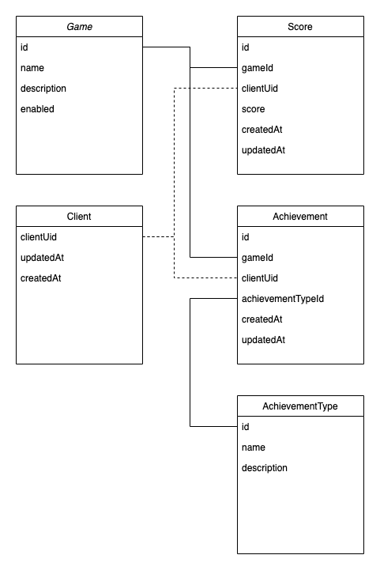

# Game score api

Work in progress!

Spring based score api for generic games. I use this for Spring and Kotlin learning. Requirement for this project is to
be as simple as possible with as less code as possible.

-------------------------

### Todo list

- [x] Implement skeleton structure.
- [x] Create score controller.
- [x] Create score model.
- [x] Create score entity.
- [x] Create score repository.
- [x] Create score service.
- [x] Learn migrations.
    - [x] Create score entity and other tables.
- [ ] Learn and create tests.
    - [x] Add a skeleton of actions builds pipeline.
    - [ ] Add tests testing controllers.
- [ ] Create build pipeline.
- [ ] Craft fully functional game score api.
    - [ ] Planning.
- [ ] Docker configurations.
- [ ] Documentations and drawings.
    - [x] Database structure drawing.
    - [ ] Getting started.

-------------------------

Table of contents
=================

* [Stack](#stack)
* [Environment](#environment)
* [Installing](#installing)

Stack
============

* Spring
    * Booted using https://start.spring.io/ with
      this [configuration](https://start.spring.io/#!type=gradle-project&language=kotlin&platformVersion=2.6.2&packaging=jar&jvmVersion=11&groupId=com.nitramite&artifactId=game-score-api&name=game-score-api&description=Generic%20game%20score%20api&packageName=com.nitramite.game-score-api&dependencies=flyway,data-jpa,web,postgresql)
      .
* Kotlin
* PostgreSQL

Structure
============
Sketch of planned database structure. 

Environment
============
todo...

Installing
============
todo...