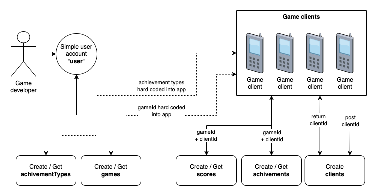
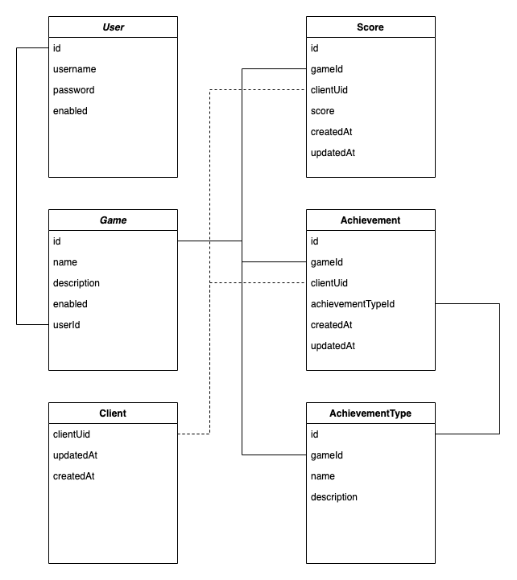

# Game score api

Spring based score api for generic games. I use this for Spring and Kotlin learning. Requirement for this project is to
be as simple as possible with as less code as possible. Final implementation most likely uses basic authentication for
clients to post and get results which is security wise bad, but PR's could bring more security schemas like OAuth or
something else.


Table of contents
=================

* [Stack](#stack)
* [Environment](#environment)
* [Installing](#installing)
* [API docs](#api-docs)
    * [Admin only](#admin-only)
    * [Everyone](#everyone)
* [Using Github container registry image](#using-github-container-registry-image)
* [Development](#development)
    * [Todo list](#todo-list)

Stack
============

* Spring
    * Booted using https://start.spring.io/ with
      this [configuration](https://start.spring.io/#!type=gradle-project&language=kotlin&platformVersion=2.6.2&packaging=jar&jvmVersion=11&groupId=com.nitramite&artifactId=game-score-api&name=game-score-api&description=Generic%20game%20score%20api&packageName=com.nitramite.game-score-api&dependencies=flyway,data-jpa,web,postgresql)
      .
* Kotlin.
* PostgreSQL.

Structure
============
Sketch of planned use case.


* User account is owned by a developer who manages games.
* Less we know about game clients the better. Find a way to get device specific unique identifier to populate clientId.
  <br>

Sketch of planned database structure.



Environment
============
You need to have Postgresql server installed. This app needs it as data store.


Installing
============
Run standalone with ide having env var string

```text
DATABASE_URL=localhost;DATABASE_USERNAME=someuser;DATABASE_PASSWORD=somepassword
```

or use docker via `docker-compose up`.

1. Create psql database called `game-scores`.
2. Rename `docker-compose.yml_tpl` to `docker-compose.yml`
3. Set `environment` variable values:

```
  - DATABASE_URL=
  - DATABASE_USERNAME=
  - DATABASE_PASSWORD=
```

4. Run `docker-compose up`.
5. Open [http://localhost:8080/](http://localhost:8080/).

API docs
============

Admin only
-------
Create and get games:

```shell
curl -X POST -H "Authorization: Basic <content>" -H "Content-Type: application/json" -d '{"name":"test game", "description":"example game", "userId": 1}' http://localhost:8080/games/game 
curl -X GET -H "Authorization: Basic <content>" -H "Content-Type: application/json" http://localhost:8080/games/games\?gameId\=1 
```

Create achievements for game:

```shell
curl -X POST -H "Authorization: Basic <content>" -H "Content-Type: application/json" -d '{"gameId":1, "name": "achievement name", "description":"example description"}' http://localhost:8080/achievements/achievementType
```

Everyone
-------
Get random generated uid for a client in case if unique identifiers are not provided by a device.

```shell
curl -X GET -H "Content-Type: application/json" http://localhost:8080/clients/generateUid

```

Post a new client, like device running game. Use this if unique uid is generated at a device side.

```shell
curl -X POST -H "Content-Type: application/json" -d '{"clientUid":"testclientuid", "nickname": "SomeNickName"}' http://localhost:8080/clients/client 
```

Change client nickname:

```shell
curl -X PATCH -H "Content-Type: application/json" -d '{"clientUid":"testclientuid", "nickname": "SomeNickName2"}' http://localhost:8080/clients/nickname 
```

Get scores, different ways:

```shell
curl -X GET -H "Content-Type: application/json" http://localhost:8080/scores/score\?gameId\=1\&clientUid\=testclientuid
curl -X GET -H "Content-Type: application/json" http://localhost:8080/scores/bestByGame\?gameId\=1
```

Post new score:

```shell
curl -X POST -H "Content-Type: application/json" -d '{"gameId":1, "clientUid": "testclientuid", "score": 100}' http://localhost:8080/scores/score 
```

Post new achievement:

```shell
curl -X POST -H "Content-Type: application/json" -d '{"gameId":1, "clientUid": "testclientuid", "achievementTypeId": 1}' http://localhost:8080/achievements/achievement 
```

Get achievements, different ways:

```shell
curl -X GET -H "Content-Type: application/json" http://localhost:8080/achievements/achievementsByGameId\?gameId\=1
curl -X GET -H "Content-Type: application/json" http://localhost:8080/achievements/achievementsByGameIdAndClientUid\?gameId\=1\&clientUid\=testclientuid
```

Using Github container registry image
============
Create file `docker-compose.yml` and paste in following contents:

```yaml
version: '3'
services:
  game-score-api:
    container_name: game-score-api
    image: ghcr.io/norkator/game-score-api:latest
    ports:
      - "8080:8080"
    environment:
      - DATABASE_URL=
      - DATABASE_USERNAME=
      - DATABASE_PASSWORD=
```

then run `sudo docker-compose up --build` and you have pre-built container running.

rebuild with the latest changes (this deletes image):

```shell
sudo docker image ls
sudo docker image rm <IMAGE ID> -f
sudo docker-compose up --build
```

start as service `docker-compose up -d --build`


Development
============
Notes and stuff for development.

Todo list
-------

- [x] Implement skeleton structure.
- [x] Create score controller.
- [x] Create score model.
- [x] Create score entity.
- [x] Create score repository.
- [x] Create score service.
- [x] Learn migrations.
    - [x] Create score entity and other tables.
- [x] Learn and create tests.
    - [x] Add a skeleton of actions builds pipeline.
    - [x] Add tests testing all controllers.
- [x] Docker configurations.
- [x] Create build pipeline.
    - [x] Github container registry image via actions.
- [x] Craft fully functional game score api.
    - [x] Planning.
- [x] Some simple authentication system.
    - [x] Planning /Basic auth?
    - [x] Multi-user basic auth.
- [x] Documentations and drawings.
    - [x] Database structure drawing.
    - [x] Getting started.
  